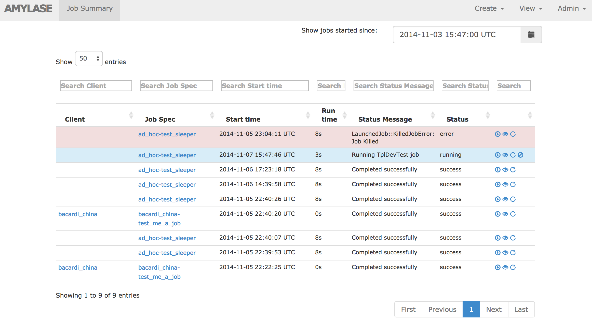

# Amylase

Amylase is a Ruby on Rails application that we use at GreatVines to manage,
schedule, and execute tasks.  In its present state, these tasks only include
certain Birst Web Services calls that we needed to automate the update of our
many Birst spaces.  In the future, we plan on using this application to manage
the automation of all aspects of data integration here at GreatVines.

This project is still in the very early stages of development.  There is
currently no method for users to log in to the application.  It is open
to anyone who can access the IP address.  We're currently running it
in AWS Elastic Beanstalk with a whitelist for the IP addresses that
need to connect.

## Features

**Job Summary**



TODOC:
* Job Summary Description
* Job Specifications
* Data Sources
* Schedules
* Clients
* Birst Spaces
* Birst Process Groups


## Setup

We currently have Amylase running within [AWS Elastic Beanstalk](http://docs.aws.amazon.com/elasticbeanstalk/latest/dg/Welcome.html)
on a "64bit Amazon Linux 2014.03 v1.0.9 running Ruby 2.1 (Passenger Standalone)"
type instance with a Postgres RDS database.

There are a number of environment variables that must be set for the application
to run properly, detailed below

````
AMYLASE_LOGGING_S3_BUCKET=# name of an S3 bucket to store logs, e.g., amylase-logs
AMYLASE_REDSHIFT_S3_HOST=# hostname of the Redshift instance holding source data
AMYLASE_REDSHIFT_S3_PASSWORD=# 'envcrypted' Redshift password
AMYLASE_REDSHIFT_S3_PORT=5439
AMYLASE_REDSHIFT_S3_SSLMODE=require
AMYLASE_REDSHIFT_S3_STAGING_PATH=# S3 path to store temporary files needed to unload Redshift data, e.g., s3://amylase-staging/amylase
AMYLASE_REDSHIFT_S3_USER=# name of Redshift user
AMYLASE_REDSHIFT_S3_DBNAME=# name of Redshift dataabase
BIRST_PWD=# 'envcrypted Birst login password
BIRST_USER=# Birst username
BUNDLE_DISABLE_SHARED_GEMS=1
BUNDLE_PATH=vendor
BUNDLE_WITHOUT=test:development
ENVCRYPT_KEY=# envcrypt decryption key (you will need to escape the '$' with '\$')
RACK_ENV=production
RAILS_SKIP_ASSET_COMPILATION=false
RAILS_SKIP_MIGRATIONS=false
SECRET_KEY_BASE=# Rails secret key
AWS_ACCESS_KEY_ID=# AWS access key for communicating with AWS S3
AWS_SECRET_KEY=# AWS secret key for communicating with AWS S3
````

#### Envcrypt

Some of the functionality of Amylase requires the use of passwords to access 3rd
party applications (such as `BIRST_PWD` and `AMYLASE_REDSHIFT_S3_PASSWORD`).  To
protect those passwords, we use a tool called
[envcrypt](https://github.com/gnilrets/envcrypt) so that we never have to store
the unencrypted password.  This requires generating a decryption key
(ENVCRYPT_KEY) and then encrypting the password using that key.  Encrypted
passwords are then safe to store in files or databases, as long as the
ENVCRYPT_KEY isn't also stored.  The only place the ENVCRYPT_KEY should be
stored is in an environment variable.

## Development

This application has been developed using Ruby 2.x,
[rbenv](https://github.com/sstephenson/rbenv), [Bundler](http://bundler.io/),
and [Pow](http://pow.cx/). We've spent a lot of effort developing a good set of
[RSpec](http://relishapp.com/rspec) tests.  So prior to deploying any code
changes, a test spec should be defined and the full suite tested via

    rspec spec

Some of the test suite performs live tests against Birst Web Services and AWS.
For those tests to work, the development environment will need to be able to
connect to valid Birst and AWS accounts.  This could be done by setting the
environment variables similar to how they would set up in production as
described above.  However, it may be more convenient to copy the relevant
sections of the `config/settings.yml` file to a `config/settings.local.yml` and
set them. This file overrides will override anything in `config/settings.yml`.
It should never be committed to the source repository (and it is .gitignored by
default).

Additionally, some of the live tests require that an object already exists
in S3 or Redshift.  These can be configured under the `test:` namespace in
`config/settings.local.yml`

## Roadmap

* User logins
* Scaling - separate the scheduler, web server, and workers
* Launch generic worker instances (e.g., ones that can run Kettle jobs)
* Birst model upgrade and deployment job templates
* [PaperTrail](https://github.com/airblade/paper_trail)
* Mechanism for configuring job dependencies (e.g., job B only runs if job A runs successfully)

## Other
######Why the name?

Amylase is an enzyme used in the brewing process that converts
long-chained starch molecules found in barley to simpler
fermentable sugars.  Amylase is also the name of this
Rails project, which is designed to take a mix of sequences of job tasks
and split them up into smaller work units.  Ok, so it's really just a
job scheduler, but it's a job scheduler with a cool name, right?
